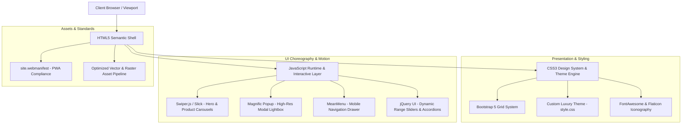

# Plutus Jewels: Bespoke Luxury Fine Jewelry Web Platform

[](https://html.spec.whatwg.org/)
[](https://www.w3.org/Style/CSS/)
[](https://developer.mozilla.org/en-US/docs/Web/JavaScript)
[](https://getbootstrap.com/)
[](LICENSE)

> *"Crafting timeless elegance through digital sophistication and meticulous web craftsmanship."*

Plutus Jewels is a responsive, client-centric luxury fine jewelry web platform and digital catalog engineered to deliver an haute joaillerie showroom experience. Designed with a focus on visual fidelity, fluid micro-interactions, and intuitive information architecture, the platform enables discerning clientele to explore bespoke collections across rings, necklaces, bracelets, pendants, and curated men's artisanal pieces.


## Abstract

In luxury retail, digital interfaces must transcend transactional mechanisms and evoke the tactile craftsmanship of fine jewelry. **Plutus Jewels** was conceptualized and scaffolded to simulate an immersive, high-end atelier catalog. Built with vanilla web fundamentals—semantic HTML5, modern modular CSS3, and orchestrated JavaScript motion engines—it delivers an opulent aesthetic without sacrificing runtime efficiency.

The platform embodies core software engineering and web development tenets: responsive cross-device ergonomics, faceted catalog navigation, progressive web readiness via standard manifest integration, and an asynchronous media showcase pipeline.


## Objective & Purpose

### **Objective**
To architect a performant, aesthetically refined digital catalog that showcases high-value jewelry collections with granular detail, responsive layouts, and seamless client inquiry conduits.

### **Key Facets**
- **Aesthetic Elevation**: Deliver a luxury brand identity via cohesive typography, muted golden palettes, and micro-animated UI states.
- **Fluid Ergonomics**: Guarantee instantaneous layout adaptation across mobile, tablet, and ultra-wide desktop viewports.
- **Frictionless Navigation**: Provide intuitive taxonomies, multi-angle gallery views, and faceted catalog filters for effortless piece discovery.
- **Client Engagement**: Integrate tailored advisory modules—including ring sizing guides, gemstone care FAQs, and dedicated consultation portals.


## Problem Statement

Traditional boutique jewelers frequently encounter friction when translating their physical showrooms into the digital realm:

1. **Visual Degradation vs. Latency Trade-off**: High-resolution imagery often induces layout thrashing, cumulative layout shifts (CLS), and sluggish page render cycles.
2. **Monolithic CMS Bloat**: Generic e-commerce templates are often weighed down by extraneous dependencies, heavy database calls, and vulnerable third-party plugins.
3. **Rigid Presentation Frameworks**: Off-the-shelf solutions lack the bespoke typographic rhythm and customized storytelling essential for haute joaillerie.

**Plutus Jewels eliminates these constraints** through an agile, lightweight architecture that pairs asynchronous script deferral and modular stylesheets with an uncluttered, distraction-free visual presentation.


## Why Plutus Jewels?

| Industry Challenge | Plutus Jewels Paradigm |
| :--- | :--- |
| **High Media Density vs. Page Speed** | Modular asset loading and decoupled slider libraries (Swiper, Slick) ensuring snappy execution. |
| **Fragmented Mobile Experience** | Strict mobile-first responsive grid using Bootstrap breakpoints and custom media queries. |
| **Monotonous Catalog Browsing** | Faceted filtering, category-specific sorting, and comprehensive multi-view product inspect pages. |
| **Opaque Gemological Details** | Dedicated educational modules, ring sizing directives, and transparent specification breakdowns. |
| **Extraneous Backend Overhead** | Pure, client-executable static architecture boasting zero attack surface and frictionless deployment. |


## Architecture & System Hierarchy

The platform employs a decoupled presentation-tier architecture where interactive components interface smoothly with the DOM while maintaining clean separation of concerns.




## Core Features

### 1. Curated Luxury Catalog & Faceted Filtering
- Categorized exploration covering **Rings, Necklaces, Earrings, Bracelets, Pendants**, and **Men’s Collections**.
- Multi-parameter dynamic filtering and sorting (`shop.html`, `shop-filter.html`) allowing seamless product discovery.

### 2. High-Fidelity Product Detail Suites
- Dedicated individual showcases (`bestnk-d1.html`, `ring-d1.html`, `pendantd-1.html`, etc.) featuring synchronized multi-angle thumbnails and zoom inspection.
- Granular specification cards covering metal purity, gemstone carat weight, dimensions, and certified hallmarking details.

### 3. Interactive Motion & Media Choreography
- Hero banners and featured collections powered by **Swiper** and **OwlCarousel** with touch-drag support and hardware-accelerated transitions.
- Lightbox magnification via **Magnific Popup** for scrutiny of intricate artisan craftsmanship.

### 4. Client Consultation & Advisory Modules
- **Guidance Suite (`guidance.html`)**: Interactive ring sizing charts, gemstone care manuals, and bespoke custom design inquiry workflows.
- **FAQ Accordion (`faq.html`)**: Expandable query resolver featuring clean SVG state transitions (`plus.svg` / `minus.svg`).

### 5. Standard-Compliant Web Architecture
- Fully valid PWA manifest (`site.webmanifest`) for standalone mobile capability.
- Semantic HTML5 structure engineered for high accessibility (a11y) and search engine discoverability.


## Repository Structure

```plaintext
PLUTUS-JEWELS/
├── assets/                     # Core brand identity vectors & logos
│   ├── PJ.png                  # Primary brand emblem
│   ├── PLUTUS_JEWELS_LOGO.png  # High-resolution vector wordmark
│   ├── minus.svg               # UI accordion collapse icon
│   └── plus.svg                # UI accordion expand icon
├── css/                        # Modular stylesheet architecture
│   ├── bootstrap.min.css       # Responsive grid scaffolding
│   ├── style.css               # Primary luxury design tokens & bespoke styles
│   ├── responsive.css          # Viewport-specific responsive overrides
│   ├── swiper-bundle.min.css   # Swiper carousel styling
│   └── fontawesome-all.min.css # Vector iconography library
├── js/                         # Client-side behavior & interaction engines
│   ├── main.js                 # Application entry point & UI orchestration
│   ├── swiper-bundle.min.js    # Multi-touch slider engine
│   ├── slick.min.js            # Product gallery synchronization
│   └── jquery.magnific-popup.min.js # Lightbox viewer
├── fonts/                      # Self-hosted typography & web font packages
├── img/                        # Organized high-fidelity product imagery
│   ├── g-rings/                # Gemstone & gold rings collection
│   ├── necklaces/              # Artisanal necklaces & chokers
│   ├── menbracelets/           # Men's luxury jewelry range
│   └── ...                     # Supplementary collection assets
├── index.html                  # Flagship landing experience
├── shop.html                   # Master product catalog
├── about.html                  # Brand heritage & artisanal mission
├── contact.html                # Boutique showroom locator & inquiry portal
├── guidance.html               # Gemological & sizing consultation guide
├── faq.html                    # Client support accordion
├── site.webmanifest            # Progressive web app manifest metadata
├── .gitignore                  # Git tracking exclusion definitions
├── LICENSE                     # MIT Open Source License
└── README.md                   # Comprehensive technical documentation
```


## Tech Stack & Engineering Specifications

- **Markup & Semantics**: HTML5 (W3C validated, accessibility-oriented semantic tags).
- **Styling Architecture**: Vanilla CSS3, CSS Custom Properties, Flexbox, CSS Grid, Bootstrap 5.
- **Scripting & DOM**: Modern JavaScript (ES6+), jQuery 1.12.4 runtime engine.
- **Interactive UI Components**:
  - *Carousel Engine*: Swiper.js v8.4.7 & Slick Slider
  - *Modal & Lightbox*: Magnific Popup
  - *Mobile Navigation*: MeanMenu
  - *Motion & Transition*: Wow.js & Animate.css
- **PWA & Standards**: Web App Manifest (`site.webmanifest`), Open Graph metadata.


## Getting Started & Local Development

Because Plutus Jewels is engineered as a static web application, no complex build steps, package managers, or server runtimes are required.

### Prerequisites
- Any modern web browser (Google Chrome, Mozilla Firefox, Safari, Microsoft Edge).
- Optional: A lightweight HTTP utility (VS Code Live Server, Python HTTP server, or Node `serve`).

### Quick Start

1. **Clone the Repository**:
   ```bash
   git clone https://github.com/Angat-Shah/Plutus-Jewels.git
   cd Plutus-Jewels
   ```

2. **Launch via Python Simple HTTP Server**:
   ```bash
   python3 -m http.server 8000
   ```
   *Navigate to `http://localhost:8000` in your web browser.*

3. **Or Open Directly**:
   Simply open `index.html` in your preferred browser.


## Design Philosophy & Engineering Principles

1. **Visual Hierarchy & Typographic Rhythm**: Serif headlines paired with minimalist sans-serif navigation create an authentic luxury atmosphere reminiscent of classic ateliers.
2. **Graceful Degradation**: Core layout structures remain readable and intuitive even on low-bandwidth networks or when JavaScript execution is restricted.
3. **Ergonomic Touch Targets**: All interactive elements (menus, thumbnails, modal controls) satisfy standard touch target guidelines for mobile usability.


## Scalability & Future Roadmap

- [ ] **Headless CMS Integration**: Hooking catalog entries into a headless backend (e.g., Strapi, Sanity) for dynamic inventory management.
- [ ] **3D WebGL Visualization**: Implementing Three.js for 360-degree interactive gemstone and ring configuration.
- [ ] **Web Payments API**: Integrating Stripe or Razorpay SDKs for end-to-end checkout orchestration.
- [ ] **Internationalization (i18n)**: Adding multi-currency conversion and multi-language support.


## License

This project is licensed under the terms of the [MIT License](LICENSE).